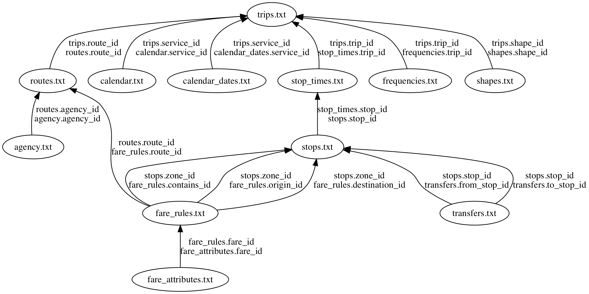

# GTFS Data

The General Transit Feed Specification ( [GTFS](http://gtfs.org/) ) is the de facto data standard for transit schedules. It was started by Portland's Transit Agency [TriMet](http://trimet.org/) and Google. 

Because it is based on a table data structure, GTFS plays well with R and with [the tidyverse](https://www.tidyverse.org/). 

And because its so prolific (your local transit agency probably publishes it), its a fun way to learn more about R. 

Finally, because the [R Studio](https://www.rstudio.com/) makes distributing your data analysis work fun and painless, R is a great language for a beginner to intermediate programmer thats interested in transit and data to make a contribution.

## Reading GTFS Data into R

Once you find a URL for GTFS data there, you can use the `trread` package to read it into R directly from the URL. 

[`trread`](https://github.com/r-transit/trread) is a package for reading data in the General Transit Feed Specification (GTFS) into R as a list of dataframes. It also does some minimal validation of the data and returns that data as part of the list of dataframes. 

## Installation

You can install `trread` from CRAN with: 

`install.packages('trread')`

## Basic Usage

Fetch data for a bus system in Accra, Ghana from GitHub. 

```{r, message=FALSE, warning=FALSE, results='hide'}
library(trread)
library(dplyr)

accra_gtfs <- import_gtfs("https://github.com/AFDLab4Dev/AccraMobility/raw/master/GTFS/GTFS_Accra.zip")
```

Count and list the number of stops per route. 

```{r}
attach(accra_gtfs)

routes_df %>% inner_join(trips_df, by="route_id") %>%
  inner_join(stop_times_df) %>% 
    inner_join(stops_df, by="stop_id") %>% 
      group_by(route_long_name) %>%
        summarise(stop_count=n_distinct(stop_id)) %>%
  arrange(desc(stop_count))
```

## Finding Data

[Transitfeeds](https://transitfeeds.com) is a great resource for finding GTFS feeds. For convenience, a list of feeds is cached in the `trread` packages. 

### By Name

You can search for GTFS URL's by name:

```{r, message=FALSE, warning=FALSE, results='hide'}
nyc_subway_feed_details <- feedlist %>%
  filter(grepl('NYC Subway GTFS', t, ignore.case= TRUE))
nyc_subway <- import_gtfs(nyc_subway_feed_details$url_d)
```

### By Geography

If you have the `sf` and `mapview` packages installed, you can also search by location:

```{r}
library(sf)
library(mapview)
feedlist_sf <- st_as_sf(feedlist, coords=c('loc_lng','loc_lat'))
mapview(feedlist_sf)
```

## How GTFS Tables are Related

[Danny Whalen](https://github.com/invisiblefunnel) made a nice graph of the relationships among gtfs tables in the [partidge](https://github.com/remix/partridge) package for Python, copied below. This can be a very helpful guide as you try to get a grasp on the kinds of questions you might want to ask of transit schedule data. 


